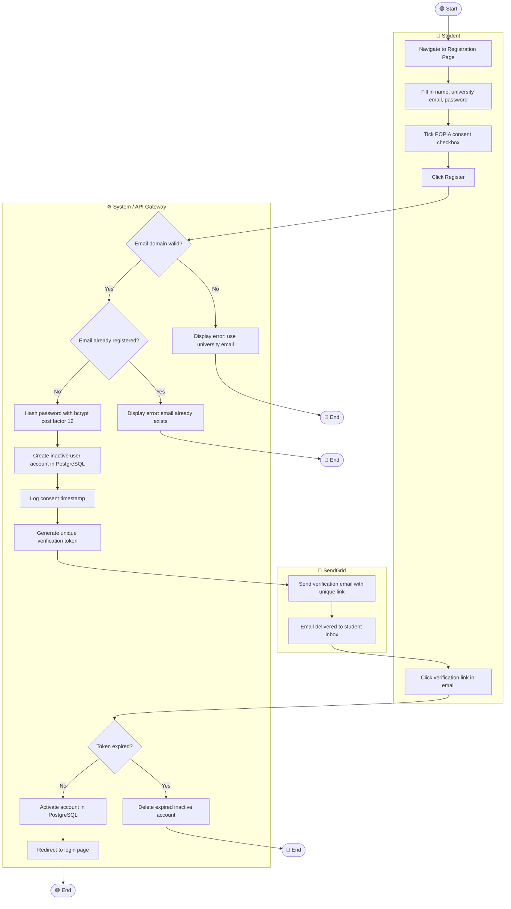
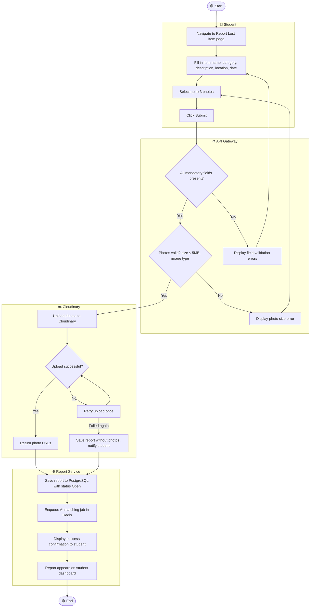
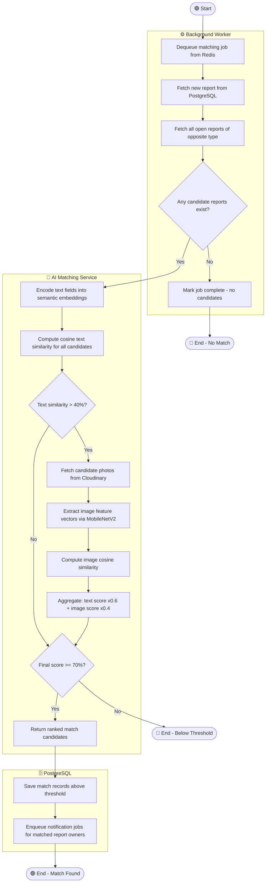
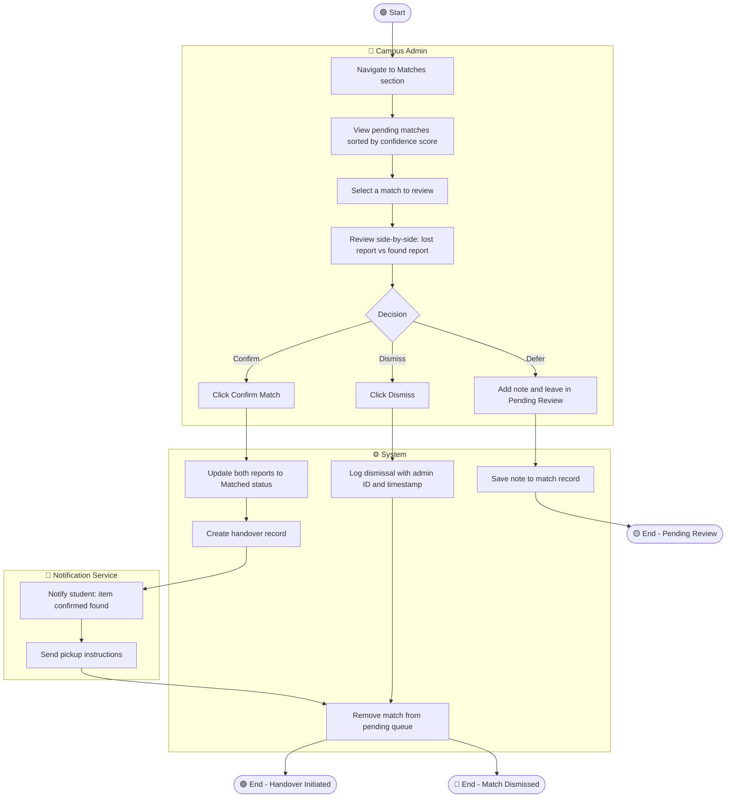
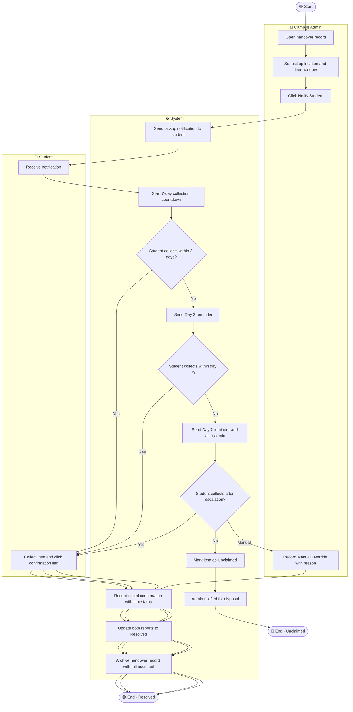
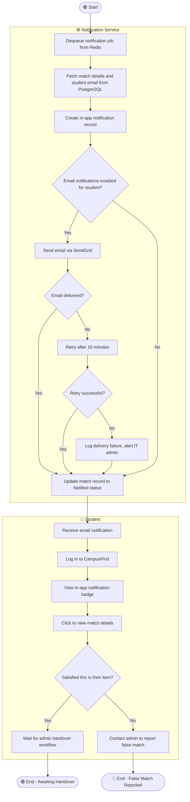
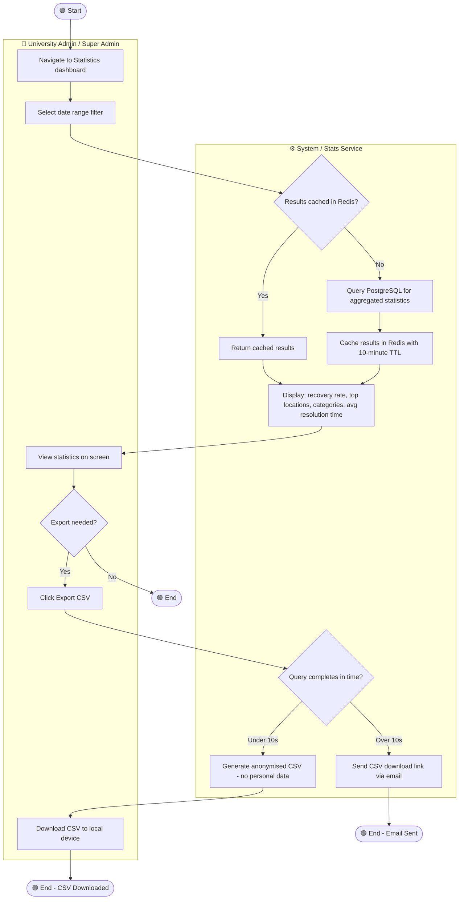
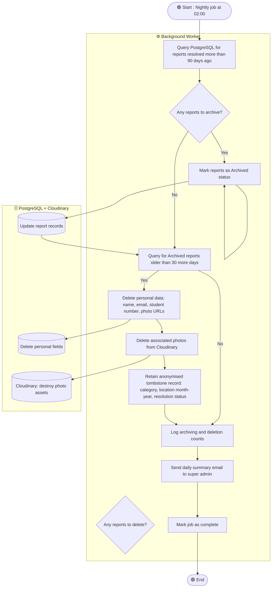

# ACTIVITY_DIAGRAMS.md — CampusFind: Smart Campus Lost & Found System
## Assignment 8: Activity Workflow Modeling

---

## Overview

This document defines 8 complex workflows in the CampusFind system using UML activity diagrams rendered in Mermaid. Each diagram includes start/end nodes, actions, decision points, parallel actions, and swimlanes showing which actor or system component is responsible for each step.

---

## Workflow 1: User Registration

### Explanation

This workflow maps directly to **FR-01** (user registration with university email validation) and **US-001**. The decision diamond at "Email domain valid?" prevents non-university emails from creating accounts, addressing the **Data Privacy Officer's** concern (S7) that only institutional users access the system. The parallel actions of hashing the password (security) and logging consent (POPIA compliance) happen simultaneously before the verification email is sent. The token expiry check addresses the alternative flow in **UC-01**.

---

## Workflow 2: Submit Lost Item Report

### Explanation

This workflow maps to **FR-03** and **US-003**. The two decision points (field validation and photo validation) implement the acceptance criteria defined in Assignment 5 TC-006 and TC-007. The photo upload retry loop addresses the alternative flow in **UC-02** (network failure during upload). The parallel outcome paths — successful upload vs. report saved without photos — ensure that a network glitch never prevents a student from filing a report at all. This addresses **Stakeholder S1's** concern that the process must be fast and resilient.

---

## Workflow 3: AI Matching Analysis

### Explanation

This workflow maps to **FR-05** and **US-005**. The text similarity pre-filter (> 40% before running image analysis) is a key performance optimisation — image analysis via MobileNetV2 is computationally expensive, so it only runs on candidates that have already passed the text similarity check. This addresses the **IT Department's** concern (S5) about server load and the **NFR-08** requirement that matching completes within 60 seconds for up to 10,000 reports. The two separate end states (No Match vs. Match Found) map directly to the alternative flows in **UC-04**.

---

## Workflow 4: Admin Match Review and Confirmation

### Explanation

This workflow maps to **FR-07** and **US-007**. The three-way decision (Confirm / Dismiss / Defer) reflects the real operational reality that admins sometimes need more information before making a decision. The parallel actions after confirmation — updating report statuses, creating the handover record, and sending the student notification — happen concurrently to minimise delay, addressing **Stakeholder S3's** concern that the match-to-notification time must be as short as possible. This maps to **TC-011** and **TC-012** in the test cases from Assignment 5.

---

## Workflow 5: Digital Handover Process

### Explanation

This workflow maps to **FR-08** and **US-008**. The escalating reminder sequence (Day 3 → Day 7 → Escalated) addresses the **Campus Admin's** concern (S3) that uncollected items need a structured follow-up process. The Manual Override path ensures that even if a student cannot access the app (e.g., no smartphone), the handover can still be completed and recorded digitally. The full audit trail at the end addresses the **University Administrator's** concern (S4) about legal accountability for item handovers.

---

## Workflow 6: Student Receives and Responds to Match Notification

### Explanation

This workflow maps to **FR-06** and **US-006**. The email opt-out path reflects the acceptance criterion that students can disable email notifications from their profile. The retry logic (up to 1 retry after 10 minutes) maps to the alternative flow in **UC-05**. The student's response decision (satisfied vs. false match) feeds back into the admin workflow — a false match report triggers admin re-review and potential dismissal of the match. This addresses **Stakeholder S1's** concern about being kept informed and **Stakeholder S3's** concern about match accuracy.

---

## Workflow 7: Admin Generates Statistics Report

### Explanation

This workflow maps to **FR-10** and **US-010**. The Redis caching layer (10-minute TTL) is critical for performance — the statistics query aggregates across potentially tens of thousands of reports, and running it on every page load would degrade system performance. The cache means repeat visits to the statistics page within 10 minutes are near-instantaneous. The email fallback for slow exports addresses **NFR-12** (page load under 3 seconds) — rather than making the admin wait for a slow query, the system responds immediately and delivers the result asynchronously. This addresses **Stakeholder S4's** need for institutional reporting data.

---

## Workflow 8: Automated POPIA Data Archiving and Deletion

### Explanation

This workflow maps to **FR-11** and **US-011**. It is the most important compliance workflow in the system, directly addressing the requirements of the **Data Privacy Officer (S7)** and POPIA legislation. The two-phase process — archive at 90 days, delete personal data at 120 days — gives the institution a 30-day window to address any disputes or administrative queries before personal data is permanently removed. The anonymised tombstone record ensures that the **University Administrator (S4)** can still generate multi-year statistics without retaining any personal data. The daily summary email ensures the super admin has an auditable record of every deletion cycle.

---

## Traceability Summary

| Diagram | Functional Requirement | User Story | Sprint Task |
|---|---|---|---|
| Workflow 1: User Registration | FR-01 | US-001 | T-003 to T-007 |
| Workflow 2: Submit Lost Report | FR-03 | US-003 | T-012 to T-015 |
| Workflow 3: AI Matching | FR-05 | US-005 | Sprint 2 |
| Workflow 4: Admin Match Review | FR-07 | US-007 | Sprint 2 |
| Workflow 5: Digital Handover | FR-08 | US-008 | Sprint 3 |
| Workflow 6: Match Notification | FR-06 | US-006 | Sprint 2 |
| Workflow 7: Statistics Report | FR-10 | US-010 | Sprint 3 |
| Workflow 8: POPIA Archiving | FR-11 | US-011 | Sprint 3 |