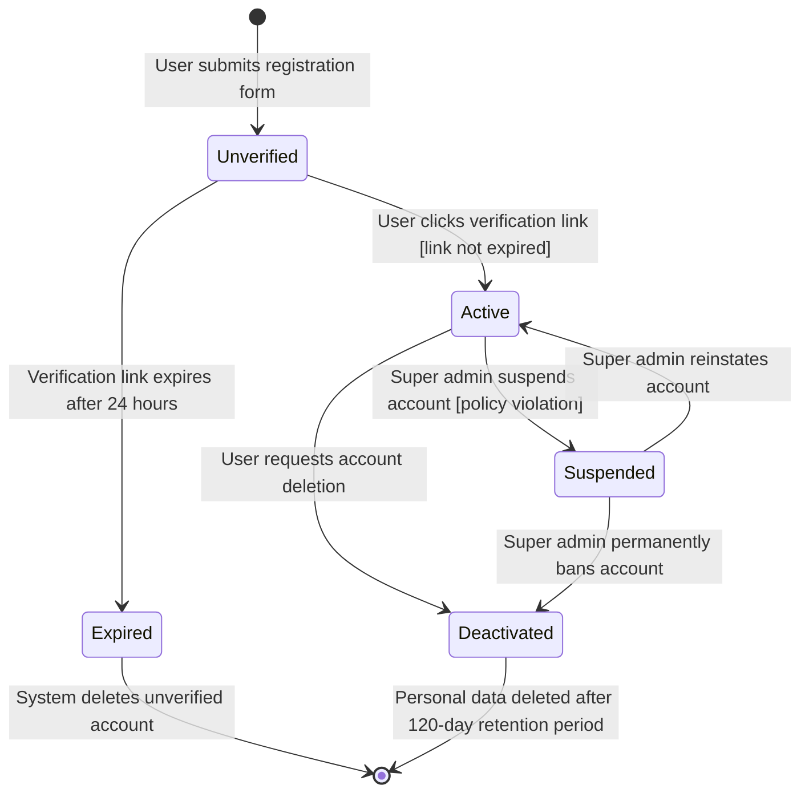
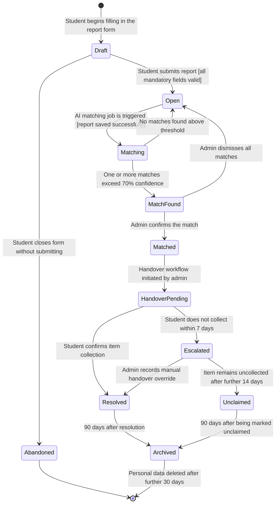
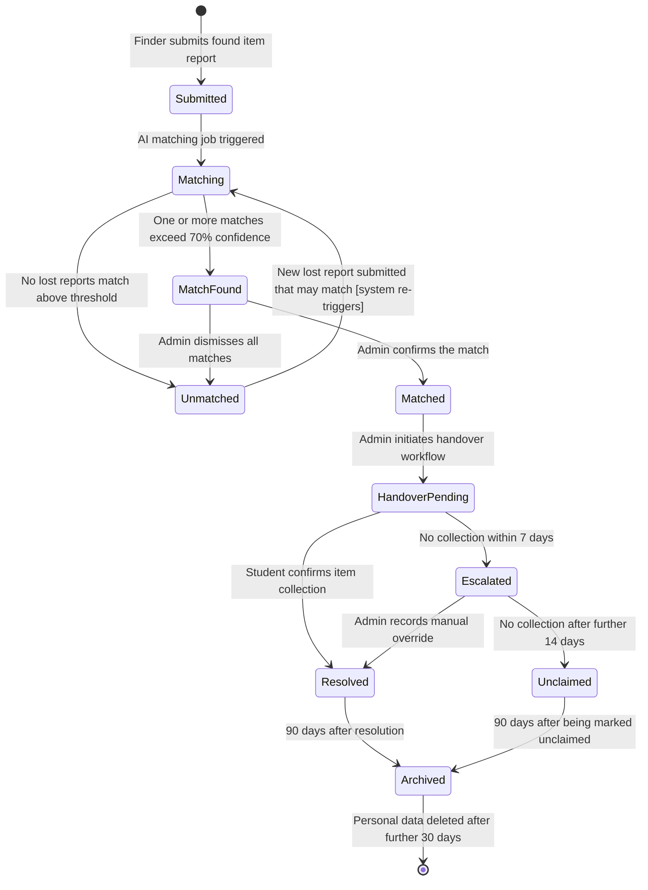
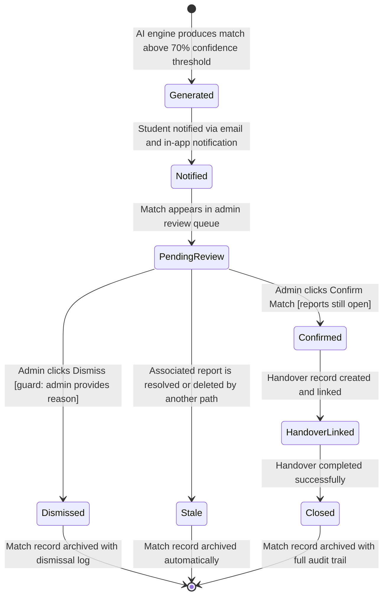
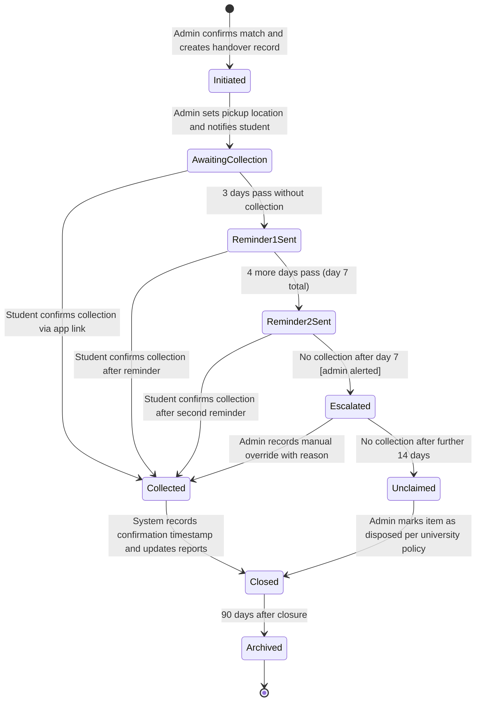
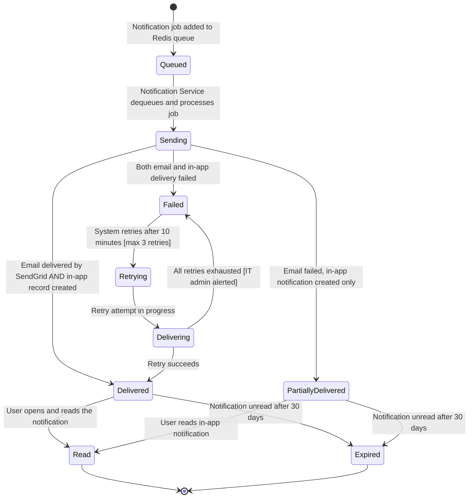
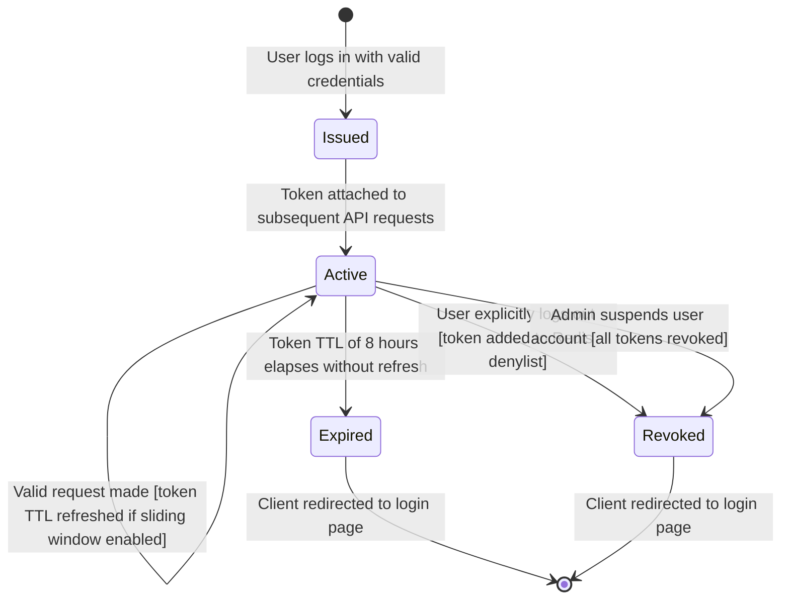

```mermaid
stateDiagram-v2
    [*] --> Selected : User selects a photo file in the report form
    Selected --> Validating : User clicks Submit [system checks file size and type]
    Validating --> Rejected : File exceeds 5MB or is not an image type [guard: size > 5MB OR type invalid]
    Validating --> Uploading : File passes validation [guard: size <= 5MB AND type valid]
    Rejected --> [*] : User informed; other valid photos proceed
    Uploading --> Stored : Cloudinary upload succeeds; URL returned and saved with report
    Uploading --> UploadFailed : Cloudinary returns error [system retries once]
    UploadFailed --> Uploading : Retry attempt
    UploadFailed --> Orphaned : Second upload attempt also fails
    Orphaned --> [*] : Report saved without photo; user notified
    Stored --> ActiveInReport : Photo URL linked to a live report
    ActiveInReport --> UsedInMatching : AI Matching Service fetches photo for image similarity analysis
    UsedInMatching --> ActiveInReport : Analysis complete; photo remains linked to report
    ActiveInReport --> Archived : Associated report is archived after retention period
    Archived --> Deleted : Cloudinary asset deleted; URL removed from database
    Deleted --> [*]
```

# STATE_DIAGRAMS.md — CampusFind: Smart Campus Lost & Found System
## Assignment 8: Object State Modeling

---

## Overview

This document defines the lifecycle of 8 critical objects in the CampusFind system using UML state transition diagrams rendered in Mermaid. Each diagram shows the states an object can be in, the events that trigger transitions between states, and any guard conditions that must be satisfied for a transition to occur.

---

## Object 1: User Account

### State Transition Diagram

### Explanation

**Key States:**
- **Unverified:** Account has been created but the university email has not yet been confirmed. The user cannot log in or submit reports in this state.
- **Active:** The account is fully operational. The user can log in, submit reports, receive notifications, and manage their profile.
- **Expired:** The 24-hour verification window has passed without the user clicking the link. The system automatically deletes the account record.
- **Suspended:** An admin has temporarily blocked the account due to a policy violation (e.g., submitting fraudulent reports). The user cannot log in.
- **Deactivated:** The account has been permanently closed, either by the user or by admin action. Personal data is scheduled for deletion.

**Traceability:**
- Unverified → Active maps to **FR-01** (email domain validation and verification).
- Active → Suspended maps to **FR-12** (role-based access control and admin powers).
- Deactivated → deletion maps to **FR-11** (POPIA-compliant data archiving and deletion).
- Traces to **US-001** (student registers account) and **US-012** (super admin manages roles).

---

## Object 2: Lost Item Report

### State Transition Diagram

### Explanation

**Key States:**
- **Draft:** Temporary state while the student is filling in the form. Not yet saved to the database.
- **Open:** Report is live and available for AI matching. The student can update or delete it.
- **Matching:** The AI matching engine is actively processing this report against found reports.
- **MatchFound:** The system has identified one or more probable matches above the confidence threshold. Awaiting admin review.
- **Matched:** An admin has confirmed a specific match. The report is locked from editing.
- **HandoverPending:** Admin has initiated the handover workflow and notified the student.
- **Resolved:** The student has confirmed collection. The report lifecycle is complete.
- **Escalated:** The student did not collect the item within 7 days. Admin is alerted.
- **Unclaimed:** Item was never collected. Flagged for disposal per university policy.
- **Archived / Deleted:** POPIA retention and deletion pipeline.

**Traceability:**
- Open → Matching maps to **FR-05** (AI matching engine).
- MatchFound → Matched maps to **FR-07** (admin confirms match).
- Matched → Resolved maps to **FR-08** (digital handover workflow).
- Archived → deletion maps to **FR-11** (POPIA compliance).
- Traces to **US-003**, **US-005**, **US-007**, **US-008**, **US-011**.

---

## Object 3: Found Item Report

### State Transition Diagram

### Explanation

**Key States:**
- **Submitted:** The found report is live and visible to admin staff immediately upon submission.
- **Unmatched:** No suitable lost report was found. The report remains active and will be re-evaluated when new lost reports are submitted.
- **MatchFound / Matched / HandoverPending / Resolved:** Mirror the lost report lifecycle — both reports must be in the same state for a handover to complete.

**Traceability:**
- Submitted → Matching maps to **FR-04** (found report submission triggers AI matching).
- Unmatched → Matching (re-trigger) maps to **FR-05** (matching runs on every new submission).
- Traces to **US-004**, **US-005**, **US-007**, **US-008**.

---

## Object 4: AI Match Record

### State Transition Diagram

### Explanation

**Key States:**
- **Generated:** A confidence score above the threshold has been computed and a match record created in the database.
- **Notified:** The student owner of the lost report has been alerted.
- **PendingReview:** The match is in the admin's queue awaiting a confirm or dismiss decision.
- **Confirmed:** Admin has verified the match is genuine. Both associated reports are locked.
- **Dismissed:** Admin determined the match was a false positive. Reason is logged.
- **Stale:** One of the associated reports was resolved by another path (e.g., student found item themselves), making this match irrelevant.
- **Closed:** The full lifecycle is complete — match confirmed, handover done, reports resolved.

**Traceability:**
- Generated → Notified maps to **FR-06** (student match notification).
- PendingReview → Confirmed/Dismissed maps to **FR-07** (admin match review).
- Confirmed → Closed maps to **FR-08** (handover workflow).
- Traces to **US-006**, **US-007**, **US-008**.

---

## Object 5: Handover Record

### State Transition Diagram

### Explanation

**Key States:**
- **Initiated:** The handover record is created when admin confirms a match.
- **AwaitingCollection:** Student has been notified with pickup details. The clock starts.
- **Reminder1Sent / Reminder2Sent:** Automated reminders sent at day 3 and day 7.
- **Escalated:** Admin is alerted that the student has not collected after 7 days.
- **Collected:** Student confirmed pickup — the primary success path.
- **Unclaimed:** Item was never collected. University disposal policy applies.
- **Closed / Archived:** Final states with audit trail preserved.

**Traceability:**
- Initiated → Collected maps to **FR-08** (digital handover workflow with audit trail).
- Reminder states map to the alternative flow in **UC-07** (student does not collect within 7 days).
- Traces to **US-008**.

---

## Object 6: Notification

### State Transition Diagram

### Explanation

**Key States:**
- **Queued:** The notification job is waiting in the Redis queue for the Notification Service to process it.
- **Sending:** The Notification Service is actively attempting email delivery and in-app record creation.
- **Delivered / PartiallyDelivered / Failed:** Reflect the three possible outcomes of the delivery attempt.
- **Retrying:** Up to 3 retry attempts are made for failed notifications before escalating to IT admin.
- **Read:** The user has acknowledged the notification.
- **Expired:** The notification was never read and has aged out.

**Traceability:**
- Queued → Delivered maps to **FR-06** (student match notification via email and in-app).
- Failed → Retrying maps to the alternative flow in **UC-05** (email delivery failure).
- Traces to **US-006**.

---

## Object 7: User Session (JWT Token)

### State Transition Diagram

### Explanation

**Key States:**
- **Issued:** A new JWT is generated upon successful login. Contains user ID, role, and expiry timestamp.
- **Active:** The token is valid and authorises API requests. The Auth Middleware validates it on every request.
- **Expired:** The 8-hour TTL has elapsed. The client must log in again to obtain a new token.
- **Revoked:** The token has been explicitly invalidated — either by logout or by admin suspension. Added to a Redis denylist so it cannot be reused before its natural expiry.

**Traceability:**
- Issued → Active maps to **FR-02** (secure login with JWT).
- Active → Revoked (logout) maps to **FR-02** (logout invalidates session).
- Active → Revoked (admin suspension) maps to **FR-12** (RBAC — admin can suspend accounts).
- Traces to **US-002**, **US-012**.

---

## Object 8: Item Photo

### State Transition Diagram

### Explanation

**Key States:**
- **Selected / Validating / Rejected:** Client-side and server-side validation before upload.
- **Uploading / Stored:** The Cloudinary upload pipeline. The photo URL is persisted with the report on success.
- **UploadFailed / Orphaned:** Failure paths with a single retry. If both attempts fail, the report is saved without photos.
- **ActiveInReport:** The normal operating state — the photo is linked to a live report and can be viewed.
- **UsedInMatching:** A transient state when the AI engine downloads and analyses the photo.
- **Archived / Deleted:** POPIA retention pipeline — when the report is archived, associated photos are deleted from Cloudinary.

**Traceability:**
- Selected → Stored maps to **FR-03** and **FR-04** (photo upload as part of report submission).
- UsedInMatching maps to **FR-05** (AI matching engine uses image similarity).
- Archived → Deleted maps to **FR-11** (POPIA data deletion).
- Traces to **US-003**, **US-004**, **US-005**, **US-011**.